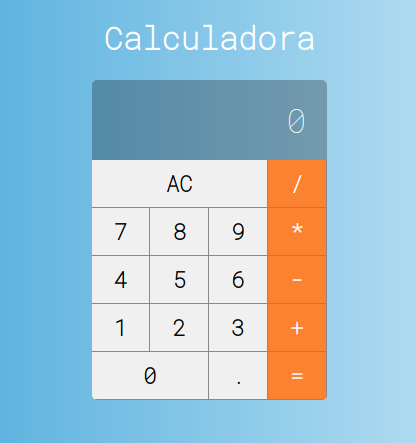

<h1 align="center">
🚀 Calculadora em React
</h1>

## Readme

Seja muito bem vindo.

## 🚀 Tecnologias

Esse projeto foi desenvolvido com as seguintes tecnologias:

- [React](https://pt-br.reactjs.org/)

## :gear: Instalação

1. Clonar o repositório com: `git clone [link do repositório]`;
2. Acesse a pasta do projeto;
3. Rodar: `npm install` para instalar as dependências;
4. Rodar: `npm start` para iniciar a Calculadora em http://localhost:3000/;
